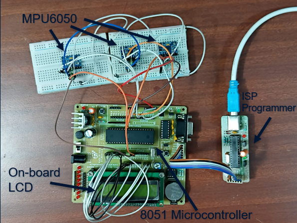
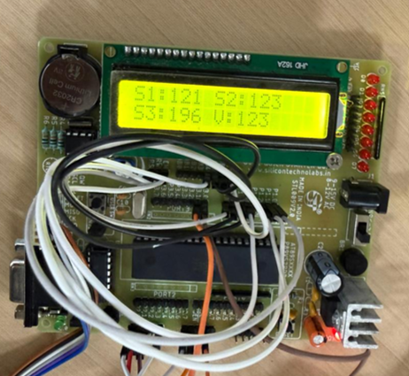

# Edge-Based Drift Detection and Compensation using 8051 and MPU6050

## 📌 Overview

This project implements a lightweight drift detection and compensation system for gyroscopic sensors using an 8051 microcontroller. The system operates entirely at the edge without requiring complex algorithms or external processing.

It uses multiple MPU6050 sensors, performs calibration to remove bias, applies drift compensation, and uses a median voting algorithm to obtain a reliable output. The results are displayed on a 16×2 LCD.

---

## 🎯 Objectives

- Acquire gyroscope data using I²C communication  
- Perform sensor calibration to estimate bias (offset)  
- Implement drift compensation in real-time  
- Improve reliability using sensor redundancy  
- Display processed output on LCD  

---

## 🧠 Concept

Low-cost sensors like MPU6050 suffer from drift, where output deviates over time even when stationary.

This project solves it using:

1. Calibration  
   Measures average bias when the system is still  

2. Compensation  
   Removes bias from future readings  

3. Median Voting  
   Rejects faulty sensor values  

---

## ⚙️ System Architecture

MPU Sensors → I²C → 8051 Microcontroller → Calibration → Compensation → Median Voting → LCD

---

## 🔌 Hardware Components

- 8051 Microcontroller (AT89C51ED2)  
- MPU6050 Gyroscope Sensor  
- 16×2 LCD Display  
- Pull-up Resistors (10kΩ for SDA & SCL)  
- Breadboard and Jumper Wires  

---

## 🔗 Connections

### LCD

| LCD Pin | 8051 Pin |
|--------|---------|
| RS     | P1.0    |
| RW     | P1.1    |
| EN     | P1.2    |
| D4-D7  | P1.4–P1.7 |

### MPU6050

| MPU Pin | 8051 Pin |
|--------|---------|
| SDA    | P3.0    |
| SCL    | P3.1    |
| VCC    | 5V      |
| GND    | GND     |

Pull-ups:

SDA → 10k → VCC  
SCL → 10k → VCC  

---

## 📊 Methodology

Calibration:  
Offset = (1/N) × Σ(sensor readings)

Drift Compensation:  
Corrected Value = Raw Value − Offset

Median Voting:  
V = median(S1, S2, S3)

---

## 🖥️ Output Format

S1:xxx S2:xxx  
S3:xxx V:xxx  

---

## 🚀 Features

- Edge-based processing (no cloud required)  
- Low computational complexity  
- Fault-tolerant sensing using redundancy  
- Real-time LCD display  

---

## 📈 Applications

- Robotics and motion sensing  
- Navigation systems  
- Embedded sensor systems  
- Educational projects  

---

## 🔮 Future Improvements

- Implement Kalman or complementary filters  
- Add full IMU fusion (accelerometer + gyro)  
- Use I²C multiplexer for multi-sensor setup  
- Add wireless monitoring (Bluetooth/Wi-Fi)  
- Add fault detection display  

---

## 👩‍💻 Authors

- Somesh T G  
- Shreya Ranjitha M  
- Akshath Palanikumaran  

---

## 🙏 Acknowledgment

We thank Vellore Institute of Technology, the Sense Department, and our faculty mentor Dr. R. Dhanush for their guidance and support.

